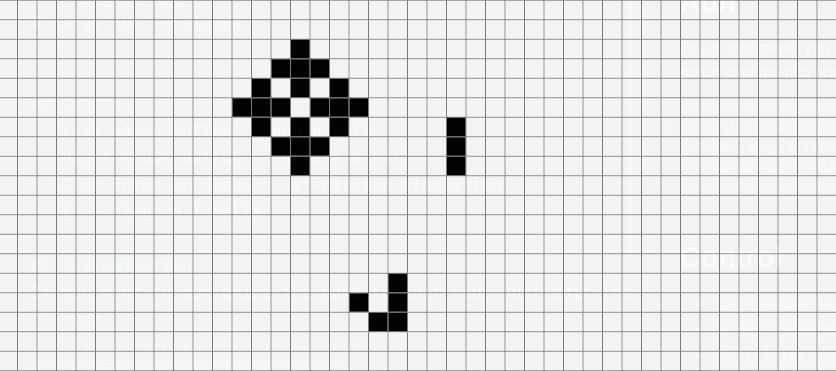

# Game of Life
A simple implementation of the Game of Life on Rust. Used `bevy` as a game engine.

## Run
To run the game, you need to install Rust and run the following command (it will take some time the first time):
```bash
$ git clone https://github.com/0x7o/game_of_life
$ cd game_of_life
$ cargo run --release
```

## Control
- `Left mouse button` - add a cell
- `Right mouse button` - delete a cell
- `P or Enter or Space` - start/stop simulation
- `E` - clear all cells

## Customization
If you want to customize the game to suit you, just edit the `src/main.rs` file:
```rust
/// Field refresh rate in seconds
const REFRESH_RATE: f32 = 0.05;
const CELL_SIZE: f32 = 18.0;
// Height and width of the window
const WIDTH: f32 = CELL_SIZE * 80.0;
const HEIGHT: f32 = CELL_SIZE * 45.0;
```